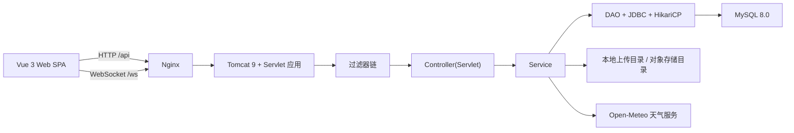
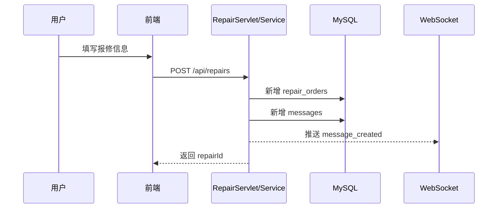
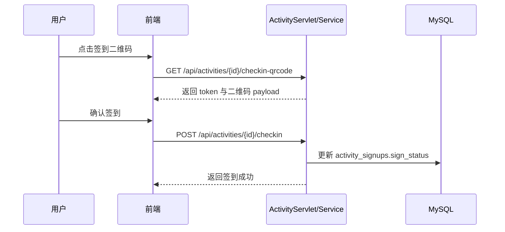

# 智能社区服务平台系统架构设计

## 1. 文档目的

本文档用于说明智慧社区服务平台的总体技术方案、模块边界、关键链路与安全设计，作为项目验收、团队汇报和后续维护的基础材料。

## 2. 建设目标

- 面向居民、物业管理员、服务商三类角色提供统一社区服务入口。
- 打通报修、活动、邻里互动、物业缴费、访客登记、消息通知等核心业务。
- 支持容器化部署、JWT 鉴权、RBAC 权限控制与实时消息提醒。
- 保持前后端分离，便于后续功能扩展和多端接入。

## 3. 总体架构

## 4. 分层说明

### 4.1 前端层

- 技术栈：Vue 3、Vite、Pinia、Vue Router、Element Plus、Axios。
- 主要职责：页面展示、路由切换、表单校验、调用后端 API、展示 WebSocket 实时通知。
- 业务页面：
  - `DashboardView`：驾驶舱总览与智能通知。
  - `ProfileView`：个人资料维护与个人历史管理。
  - `RepairsView`：报修提交、进度跟踪、评价、工单看板。
  - `ActivitiesView`：活动发布、报名、签到二维码、活动回顾。
  - `PropertyView`：物业费、停车位、访客登记。
  - `NeighborhoodView`：邻里互动发布与关闭。
  - `MessagesView`：消息列表与已读处理。

### 4.2 接入层

- 由 Nginx 提供静态资源服务，并将 `/api/` 反向代理到 Tomcat，将 `/ws/` 反向代理到 WebSocket 端点。
- 前端部署后仅暴露一个统一入口端口 `3674`，减少跨域配置复杂度。

### 4.3 后端业务层

- 技术栈：Java 17、Servlet、Filter、Listener、JDBC、HikariCP、JWT。
- 组织方式：
  - `controller`：按业务域拆分 HTTP 接口。
  - `service`：封装业务规则、事务、消息触发。
  - `dao`：负责 SQL 与数据映射。
  - `model/dto`：实体与请求体对象。
  - `storage`：图片存储抽象，支持本地目录与对象存储目录。

### 4.4 数据层

- 数据库：MySQL 8.0。
- 连接池：HikariCP。
- 初始化脚本：`backend/src/main/resources/db/init.sql`。
- 支持基础演示数据自动注入，便于验收与联调。

## 5. 过滤器与安全链路

请求进入后端后按以下顺序处理：

1. `ExceptionHandlingFilter`
   - 统一捕获业务异常与系统异常，保证 API 响应结构一致。
2. `CharacterEncodingFilter`
   - 统一字符集，避免中文乱码。
3. `CorsFilter`
   - 允许前端跨域访问接口。
4. `JwtAuthenticationFilter`
   - 对开放接口之外的请求执行 JWT 身份校验。
5. `RoleAuthorizationFilter`
   - 对物业模块、工单状态修改等接口执行角色控制。
6. `DataEncryptionFilter`
   - 对响应体中的手机号、身份证等敏感字段进行脱敏处理。
7. `RequestLogFilter`
   - 记录方法、路径、状态码、耗时、操作者，落库到 `operation_logs`。

## 6. 核心业务模块架构

### 6.1 用户与身份认证

- 支持注册、登录、退出、获取个人快照。
- 居民注册时触发身份证号加密存储与实名状态初始化。
- 登录成功后返回 JWT，用于接口鉴权和 WebSocket 建连。

### 6.2 报修模块

- 居民提交工单，可附带图片。
- 物业管理员/服务商查看工单看板并更新状态、指派处理人。
- 工单完成后居民可进行评分与评价。
- 状态变化会同步写入消息中心并触发实时通知。

### 6.3 社区活动模块

- 支持活动创建、活动报名、签到二维码生成、签到校验、活动回顾发布。
- 签到二维码采用基于 `HmacSHA256` 的动态 Token 生成机制。
- 只有已报名且已签到的用户才能提交活动回顾。

### 6.4 物业服务模块

- 展示物业费账单、支付流水、停车位、访客记录。
- 支持登记访客和在线缴费。
- 支付采用“生成支付单 + 确认支付”的演示型链路，便于课程项目展示。

### 6.5 邻里互动模块

- 支持社区圈、二手、技能互换、失物招领四类帖子。
- 帖子发布者可主动关闭帖子。

### 6.6 消息与实时通知

- 业务完成后通过 `messages` 表记录站内消息。
- 同时通过 `/ws/notifications` 推送实时消息事件，实现即时提醒。

## 7. 关键时序设计

### 7.1 报修提交流程

### 7.2 活动签到流程

## 8. 非功能设计

### 8.1 安全性

- JWT 鉴权。
- 角色权限控制。
- 敏感字段脱敏。
- 居民身份证加密存储。
- 文件下载接口限制路径穿越。

### 8.2 可维护性

- 前后端分离。
- DAO/Service/Controller 分层清晰。
- API 响应统一结构：`code + message + data`。
- OpenAPI 文档可通过 `/api/openapi.json` 和 `/api-docs` 访问。

### 8.3 可部署性

- 全链路 Docker 化。
- 前端、后端、数据库三容器独立部署。
- 数据目录、上传目录采用 volume 持久化。

## 9. 架构结论

本项目采用“Vue 3 + Nginx + Java Servlet + MySQL”的轻量型分层架构，既满足课程项目对完整业务闭环、权限控制、数据库设计和部署运维的要求，也为后续继续扩展小程序端、移动端或更多社区场景预留了空间。
