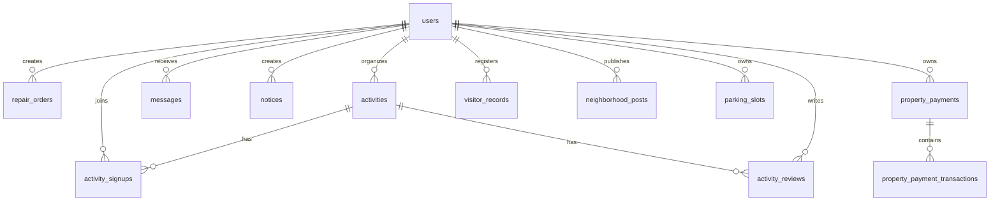

# 智能社区服务平台数据库设计

## 1. 文档说明

本文档基于当前项目实现整理数据库结构、主外键关系、关键字段说明与初始化策略，用于课程答辩、数据库设计说明和后续维护。

## 2. 数据库概览

- 数据库类型：MySQL 8.0
- 字符集：`utf8mb4`
- 初始化脚本：`backend/src/main/resources/db/init.sql`
- 连接方式：JDBC + HikariCP

## 3. E-R 关系概览

## 4. 数据表设计

### 4.1 `users` 用户表

| 字段 | 类型 | 说明 |
| --- | --- | --- |
| `id` | BIGINT PK | 用户主键 |
| `username` | VARCHAR(64) UNIQUE | 登录账号 |
| `password_hash` | VARCHAR(255) | 密码哈希 |
| `role` | VARCHAR(32) | 角色：居民/物业/服务商 |
| `full_name` | VARCHAR(64) | 姓名 |
| `phone` | VARCHAR(32) | 手机号 |
| `email` | VARCHAR(128) | 邮箱 |
| `real_name_verified` | TINYINT(1) | 实名认证状态 |
| `id_card_enc` | VARCHAR(512) | 加密后的身份证号 |
| `status` | VARCHAR(16) | 账号状态 |
| `created_at` | DATETIME | 创建时间 |
| `updated_at` | DATETIME | 更新时间 |

设计说明：

- `username` 唯一，避免重复注册。
- `id_card_enc` 只对居民角色启用，用于实名验证场景。
- `updated_at` 自动更新时间，便于资料维护审计。

### 4.2 `repair_orders` 报修工单表

| 字段 | 类型 | 说明 |
| --- | --- | --- |
| `id` | BIGINT PK | 工单主键 |
| `user_id` | BIGINT FK | 发起人 |
| `title` | VARCHAR(120) | 报修标题 |
| `description` | TEXT | 报修描述 |
| `image_url` | VARCHAR(255) | 附图地址 |
| `status` | VARCHAR(32) | 工单状态 |
| `assigned_provider_id` | BIGINT | 指派服务商 |
| `rating` | INT | 居民评分 |
| `rating_comment` | VARCHAR(255) | 评价内容 |
| `created_at` | DATETIME | 创建时间 |
| `updated_at` | DATETIME | 更新时间 |

设计说明：

- `status` 支持 `PENDING / IN_PROGRESS / COMPLETED`。
- `updated_at` 是报修进度跟踪的重要依据。

### 4.3 `activities` 活动表

| 字段 | 类型 | 说明 |
| --- | --- | --- |
| `id` | BIGINT PK | 活动主键 |
| `title` | VARCHAR(120) | 活动标题 |
| `description` | TEXT | 活动描述 |
| `location` | VARCHAR(120) | 活动地点 |
| `start_time` | DATETIME | 开始时间 |
| `organizer_id` | BIGINT FK | 发起人 |
| `organizer_role` | VARCHAR(32) | 发起人角色 |
| `created_at` | DATETIME | 创建时间 |

### 4.4 `activity_signups` 活动报名表

| 字段 | 类型 | 说明 |
| --- | --- | --- |
| `id` | BIGINT PK | 主键 |
| `activity_id` | BIGINT FK | 所属活动 |
| `user_id` | BIGINT FK | 报名用户 |
| `sign_status` | VARCHAR(32) | 报名/签到状态 |
| `signed_at` | DATETIME | 签到时间 |
| `created_at` | DATETIME | 创建时间 |

设计说明：

- `(activity_id, user_id)` 建立唯一约束，防止重复报名。
- `sign_status` 支持 `REGISTERED / SIGNED_IN`。

### 4.5 `activity_reviews` 活动回顾表

| 字段 | 类型 | 说明 |
| --- | --- | --- |
| `id` | BIGINT PK | 主键 |
| `activity_id` | BIGINT FK | 所属活动 |
| `user_id` | BIGINT FK | 评论用户 |
| `rating` | INT | 活动评分 |
| `content` | VARCHAR(255) | 回顾内容 |
| `photo_url` | VARCHAR(255) | 回顾照片 |
| `created_at` | DATETIME | 创建时间 |

### 4.6 `messages` 消息表

| 字段 | 类型 | 说明 |
| --- | --- | --- |
| `id` | BIGINT PK | 消息主键 |
| `receiver_id` | BIGINT FK | 接收人 |
| `sender_id` | BIGINT | 发送人，可空 |
| `message_type` | VARCHAR(32) | 消息类型 |
| `title` | VARCHAR(120) | 标题 |
| `content` | TEXT | 内容 |
| `is_read` | TINYINT(1) | 是否已读 |
| `created_at` | DATETIME | 创建时间 |

### 4.7 `notices` 公告表

| 字段 | 类型 | 说明 |
| --- | --- | --- |
| `id` | BIGINT PK | 公告主键 |
| `title` | VARCHAR(120) | 标题 |
| `content` | TEXT | 内容 |
| `is_emergency` | TINYINT(1) | 是否紧急 |
| `created_by` | BIGINT FK | 发布人 |
| `created_at` | DATETIME | 创建时间 |

### 4.8 `property_payments` 物业费账单表

| 字段 | 类型 | 说明 |
| --- | --- | --- |
| `id` | BIGINT PK | 账单主键 |
| `user_id` | BIGINT FK | 居民 |
| `amount` | DECIMAL(10,2) | 金额 |
| `pay_status` | VARCHAR(32) | 缴费状态 |
| `paid_at` | DATETIME | 支付完成时间 |
| `created_at` | DATETIME | 创建时间 |

### 4.9 `property_payment_transactions` 支付流水表

| 字段 | 类型 | 说明 |
| --- | --- | --- |
| `id` | BIGINT PK | 流水主键 |
| `payment_id` | BIGINT FK | 关联账单 |
| `user_id` | BIGINT FK | 支付人 |
| `pay_no` | VARCHAR(64) UNIQUE | 支付流水号 |
| `amount` | DECIMAL(10,2) | 金额 |
| `channel` | VARCHAR(32) | 支付渠道 |
| `status` | VARCHAR(32) | 流水状态 |
| `paid_at` | DATETIME | 支付时间 |
| `created_at` | DATETIME | 创建时间 |

### 4.10 `parking_slots` 停车位表

| 字段 | 类型 | 说明 |
| --- | --- | --- |
| `id` | BIGINT PK | 主键 |
| `slot_no` | VARCHAR(40) UNIQUE | 车位编号 |
| `status` | VARCHAR(32) | 空闲/占用 |
| `owner_user_id` | BIGINT FK | 车位归属用户 |
| `created_at` | DATETIME | 创建时间 |

### 4.11 `visitor_records` 访客登记表

| 字段 | 类型 | 说明 |
| --- | --- | --- |
| `id` | BIGINT PK | 主键 |
| `resident_id` | BIGINT FK | 登记居民 |
| `visitor_name` | VARCHAR(80) | 访客姓名 |
| `visit_time` | DATETIME | 到访时间 |
| `status` | VARCHAR(32) | 审批状态 |
| `created_at` | DATETIME | 创建时间 |

### 4.12 `neighborhood_posts` 邻里互动表

| 字段 | 类型 | 说明 |
| --- | --- | --- |
| `id` | BIGINT PK | 帖子主键 |
| `user_id` | BIGINT FK | 发布用户 |
| `category` | VARCHAR(32) | 分类 |
| `title` | VARCHAR(120) | 标题 |
| `content` | TEXT | 内容 |
| `price` | DECIMAL(10,2) | 价格，可空 |
| `contact` | VARCHAR(80) | 联系方式 |
| `status` | VARCHAR(16) | 帖子状态 |
| `created_at` | DATETIME | 创建时间 |
| `updated_at` | DATETIME | 更新时间 |

### 4.13 `operation_logs` 操作日志表

| 字段 | 类型 | 说明 |
| --- | --- | --- |
| `id` | BIGINT PK | 日志主键 |
| `user_id` | BIGINT | 用户 ID，可空 |
| `username` | VARCHAR(64) | 用户名 |
| `action` | VARCHAR(120) | 行为标识 |
| `path` | VARCHAR(200) | 请求路径 |
| `method` | VARCHAR(10) | 请求方法 |
| `status_code` | INT | 状态码 |
| `duration_ms` | BIGINT | 耗时 |
| `created_at` | DATETIME | 创建时间 |

## 5. 关键约束与索引设计

- `users.username` 唯一约束，避免重复账号。
- `activity_signups(activity_id, user_id)` 唯一约束，防止重复报名。
- `property_payment_transactions.pay_no` 唯一约束，保证支付流水唯一。
- `parking_slots.slot_no` 唯一约束，保证车位编号唯一。
- 多张业务表通过外键与 `users`、`activities`、`property_payments` 关联，保证数据完整性。

## 6. 数据安全设计

- 身份证号通过 `SensitiveCryptoUtil` 加密存储在 `id_card_enc`。
- 返回前端的手机号、身份证等敏感字段由 `DataEncryptionFilter` 进行脱敏。
- 文件访问接口禁止 `..` 路径穿越。

## 7. 初始化与演示数据

初始化脚本已提供以下演示数据：

- 3 个演示账号：居民、物业管理员、服务商。
- 2 条报修工单。
- 2 个活动与 1 条报名记录。
- 物业费账单、支付流水、停车位与访客记录。
- 若干邻里互动帖子与活动回顾记录。

## 8. 数据库设计结论

当前数据库设计已经覆盖用户认证、报修、活动、物业、消息、互动、日志等完整业务链路，结构清晰、主外键明确，能够支撑课程项目展示与后续功能迭代。
